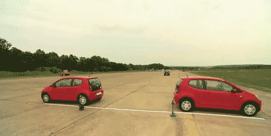

## Índice
## Índice
<details>
<summary>Práctica 3</summary>

- [Objetivo](#objetivo)
- [Teoría y Funcionamiento](#teoría-y-funcionamiento)
  * [Funcionamiento del LIDAR](#funcionamiento-del-lidar)
  * [LIDAR para el movimiento](#lidar-para-el-movimiento)
  * [Máquina de estados](#máquina-de-estados)
  * [Algoritmo de aparcamiento](#algoritmo-de-aparcamiento)
- [Dificultades encontradas](#dificultades-encontradas)
- [Video](#video)

</details>


## Práctica 3 - Aparcamiento Autónomo



## Objetivo

El objetivo de esta práctica es desarrollar un sistema de **aparcamiento autónomo** capaz de maniobrar de forma segura y eficiente en diferentes escenarios urbanos. El robot debe detectar un hueco disponible utilizando los sensores láser y ejecutar la maniobra completa de estacionamiento en paralelo de manera automática.

El sistema es capaz de:

- **Aparcar entre dos coches**, realizando la maniobra completa en espacio reducido.  
- **Aparcar con un coche solo delante**, ajustando el ángulo de entrada para no colisionar.  
- **Aparcar con un coche solo detrás**, aprovechando el espacio libre frontal.  
- Mantener la orientación y distancia adecuadas respecto a los vehículos y bordillos usando la información de los sensores LIDAR.


## Teoría y Funcionamiento

### Funcionamiento del LIDAR

El vehículo dispone de tres sensores LIDAR (frontal, derecho y trasero) que devuelven 180 medidas de distancia en metros dentro de su campo de visión.  Cada medida representa la distancia a los obstáculos dentro del rango operativo del sensor.

Para evitar valores erróneos o ruido en la lectura, las distancias se **filtran y procesan** antes de ser utilizadas por la lógica de control.  

El filtrado consiste en:

1. **Eliminar valores fuera del rango válido** (`minRange` y `maxRange` del sensor).  
2. **Ordenar las medidas por distancia** para quedarse con los puntos más cercanos (los que representan los objetos reales).  
3. **Calcular la media de las distancias más cortas**, en lugar de usar una única medida, lo que proporciona una lectura más estable y robusta frente a reflejos o ruido puntual.

> ```python
> # Seleccionar los valores válidos del LIDAR
> valores_validos = [v for v in laser.values if laser.minRange < v < laser.maxRange]
> 
> # Calcular la media de los más cercanos (por ejemplo, el 20% más corto)
> dist_media = sum(sorted(valores_validos)[:int(len(valores_validos)*0.2)]) / int(len(valores_validos)*0.2)
> ```

Con este procesamiento, cada LIDAR proporciona una **distancia filtrada** que el sistema usa para:
- Determinar la **proximidad lateral** al resto de vehículos (sensor derecho).  
- Evitar colisiones frontales o traseras durante las maniobras (sensores frontal y trasero).  
- Detectar huecos disponibles midiendo la variación en la distancia lateral mientras el coche avanza recto.

### LIDAR para el movimiento

Una vez filtradas las medidas del LIDAR, el robot utiliza estas distancias como **referencias dinámicas** para ajustar su velocidad y dirección de movimiento en cada estado de la maniobra. El sistema no emplea navegación global ni mapas predefinidos; todo el movimiento se basa en la información **en tiempo real** de los sensores láser.

El principio de control se resume en tres ideas:

1. **Sensor derecho → control de distancia lateral**  
   El LIDAR derecho permite mantener una separación constante respecto a los vehículos aparcados.  
   Esta distancia lateral se compara con un valor objetivo y, según el error, el robot ajusta su **velocidad angular** (`W`) para enderezarse o acercarse más al lateral.

2. **Sensor frontal → detección de obstáculos y frenado automático**  
   El LIDAR frontal se usa para evitar colisiones cuando el coche se aproxima demasiado a otro vehículo o al final del hueco.  
   Si la distancia frontal cae por debajo de un umbral, la velocidad lineal (`V`) se reduce progresivamente hasta detener el coche por completo.

3. **Sensor trasero → control durante las maniobras de aparcamiento**  
   En la fase de marcha atrás, el LIDAR trasero supervisa el espacio disponible detrás del vehículo.  
   Si el sensor detecta una distancia inferior al límite de seguridad, el robot frena y finaliza la maniobra.


### Máquina de estados

Para organizar el comportamiento del vehículo y simplificar la lógica de control, implementé una **máquina de estados finitos (FSM)**. Cada estado representa una fase concreta del aparcamiento, con sus propias condiciones de entrada y salida. De esta forma, el robot puede reaccionar a la información de los sensores en tiempo real y cambiar de comportamiento sin necesidad de estructuras complejas ni bucles anidados.

Los estados diseñados son los siguientes:

1. **ACERCAR** → El vehículo se aproxima a la fila de coches y se alinea con ellos manteniendo una distancia lateral y frontal seguras.  
   En este estado se controla la velocidad y el ángulo de orientación mediante el LIDAR derecho y frontal.

2. **ENDEREZAR** → Una vez alcanzada la posición deseada, el coche corrige su orientación hasta quedar paralelo a la fila.  
   Se usan los datos del LIDAR derecho para comprobar que la parte delantera y trasera están a la misma distancia del lateral.

3. **BUSCAR_PARKING** → El robot avanza recto junto a la fila de coches midiendo la distancia lateral.  
   Cuando detecta una separación mayor de la habitual, inicia el registro de la longitud del hueco.  
   Si el hueco alcanza la distancia mínima o el sensor derecho vuelve a medir una pared, se considera un espacio válido para aparcar.

4. **MENTALIZANDOME** → Estado de pausa antes de ejecutar la maniobra final, todos necesitamos unos segundos de reflexión antes de aparcar...

5. **APARCAR** → El coche realiza la maniobra completa: marcha atrás, giros controlados y ajustes finales hasta quedar correctamente aparcado dentro del hueco, sin colisiones y paralelo al bordillo.

6. **COMPLETADO** → Estado final. Se detienen los motores y se confirma que el aparcamiento se ha realizado con éxito.


### Algoritmo de aparcamiento

El algoritmo de aparcamiento combina la información de los sensores LIDAR con la máquina de estados para ejecutar una maniobra completa de estacionamiento en paralelo. El proceso sigue una secuencia lógica y reactiva, donde cada etapa depende de las mediciones obtenidas en tiempo real.

El flujo de funcionamiento es el siguiente:

1. **Acercamiento:** el robot se aproxima lentamente a la fila de vehículos hasta mantener una distancia lateral constante respecto al coche más cercano.  
2. **Alineación:** se endereza y se coloca paralelo a la fila utilizando el LIDAR derecho como referencia.  
3. **Búsqueda de hueco:** avanza en línea recta midiendo la distancia lateral. Si el sensor derecho detecta un aumento significativo en la distancia, se considera el inicio de un hueco; al volver a detectar un obstáculo, se calcula la longitud total del espacio.
4. **Verificación del hueco:** si el hueco tiene una longitud suficiente máxima de 7.5m, el vehículo se detiene y se prepara para maniobrar. En caso de haber un coche delante necesita encontrar el coche y haber detectado minimo un hueco de 4.5 m.
5. **Maniobra de aparcamiento:** el robot realiza un conjunto de giros y movimientos de marcha atrás controlados, ajustando su posición con los sensores frontal y trasero para no chocar con otros vehículos.
6. **Ajuste final:** una vez dentro del hueco, corrige su orientación y avanza o retrocede ligeramente hasta quedar paralelo y centrado respecto a los coches vecinos.

### Dificultades encontradas

Al principio me costó bastante entender cómo empezar a trabajar con los datos del LIDAR. No tenía claro qué valores eran realmente útiles ni cómo interpretarlos para saber a qué distancia estaba de los coches. Después de muchas pruebas y lecturas del sensor, conseguí hacer un filtrado que me diera una medida estable y que no variara tanto con el ruido o los reflejos.

También fue complicado ajustar los giros y velocidades para que el coche se moviera de forma suave y no hiciera movimientos bruscos o extraños durante el aparcamiento. Tuve que probar diferentes combinaciones de velocidad lineal y angular hasta conseguir una maniobra fluida que no chocara con los otros coches y quedara más o menos centrado dentro del hueco.

## Video

Disculpa la calidad de los videos, lo tuve que grabar con el móvil ya que mi ordenador no tiene la capacidad suficiente para grabar y ejecutar la simulación al mismo tiempo.


**Video**  
[](https://youtube.com/shorts/oAI35c9c5pI)
