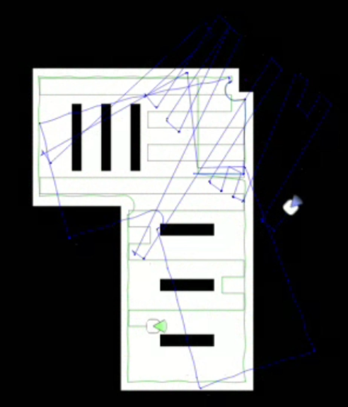
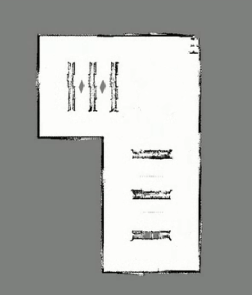

## Índice
<details>
<summary>Práctica 5 - Laser Mapping</summary>

- [Errores comentados en tutoría](#errores-comentados-en-tutoría)
- [Objetivo](#objetivo)
- [Teoría y Funcionamiento](#teoría-y-funcionamiento)
  * [LIDAR y Adquisición de Datos](#lidar-y-adquisición-de-datos)
  * [Mapa de Ocupación Probabilístico](#mapa-de-ocupación-probabilístico)
  * [Implementación Bayesiana con Log-Odds](#implementación-bayesiana-con-log-odds)
  * [Filtrado de Rayos y Observaciones Independientes](#filtrado-de-rayos-y-observaciones-independientes)
  * [Trazado de Láser con Bresenham](#trazado-de-láser-con-bresenham)
  * [Exploración y Navegación](#exploración-y-navegación)
  * [Prueba con getPose3d y getOdom2](#prueba-con-getpose3d-y-getodom2)
- [Dificultades Encontradas](#dificultades-encontradas)
- [Video](#video)
- [Mapa final](#mapa-final)

</details>


<p align="center">
  
</p>


## Errores comentados en tutoría

Tras la revisión de la práctica, los errores principales estaban relacionados con la calidad del mapa generado. El primero fue que el robot se movía demasiado rápido, lo que hacía que las lecturas del láser se integrasen con poses poco estables y el mapa terminase saliendo torcido. Para corregirlo reduje las velocidades de navegación y separé las velocidades según el modo de movimiento: búsqueda de pared, seguimiento de pared, recuperación y barrido.

El segundo punto fue que no convenía usar todos los rayos del láser en todas las iteraciones, porque muchas observaciones seguidas son casi idénticas y pueden hacer que el mapa se vuelva demasiado rígido o ruidoso. Para solucionarlo añadí un submuestreo con `PASO_LASER = 2`, filtros de lecturas inválidas y un umbral mínimo de movimiento antes de actualizar de nuevo el mapa.

El tercer punto fue implementar realmente un mapa probabilístico usando Bayes. En la versión corregida no guardo simplemente estados discretos de libre/ocupado, sino una rejilla de log-odds (`log_grid`) que acumula evidencia de ocupación o de espacio libre y se satura para evitar una inercia excesiva.

## Objetivo

El objetivo de esta práctica es diseñar un sistema capaz de explorar un entorno desconocido utilizando un sensor LIDAR y construir simultáneamente un mapa de ocupación probabilístico. El robot debe desplazarse de forma autónoma, detectar obstáculos, actualizar el mapa en tiempo real y tomar decisiones de navegación basadas en la información del láser.

Además, el enunciado propone comprobar cómo cambia la calidad del mapa al usar distintas fuentes de localización. Por eso en el vídeo incluyo ejecuciones usando `HAL.getPose3d()` y `HAL.getOdom2()`, para comparar el resultado con una pose más precisa frente a una odometría más ruidosa.

## Teoría y Funcionamiento

### LIDAR y Adquisición de Datos

El sensor LIDAR mide distancias entre el robot y los obstáculos del entorno. Cada lectura tiene una distancia y un ángulo relativo al robot. A partir de esos datos se calcula la posición del punto detectado en coordenadas locales y después se transforma a coordenadas globales usando la pose actual del robot (`x`, `y`, `yaw`).

En el código, esta conversión se realiza en `procesar_laser()`. Primero se obtiene el ángulo real de cada rayo con `angulo_rayo_laser()`, teniendo en cuenta si el láser devuelve 180, 360 u otro número de medidas. Después se pasa de coordenadas polares a cartesianas:

```python
xl = distancia * math.cos(angulo_rayo)
yl = distancia * math.sin(angulo_rayo)
```

Y finalmente se rota y traslada ese punto al sistema global:

```python
xg = x_rob + xl * cos_rob - yl * sin_rob
yg = y_rob + xl * sin_rob + yl * cos_rob
```

### Mapa de Ocupación Probabilístico

El mapa se representa como una rejilla de `970 x 1500` celdas, que es el tamaño que espera `WebGUI.setUserMap()`. Aunque visualmente el mapa se ve como una imagen en escala de grises, internamente no trabajo directamente con valores blanco/gris/negro, sino con una matriz probabilística:

```python
log_grid = np.full((ALTO, ANCHO), LO_INICIAL, dtype=np.float32)
```

Cada celda empieza con incertidumbre total, equivalente a probabilidad `0.5`. Si un rayo del láser atraviesa una celda, esa celda recibe evidencia de espacio libre. Si el rayo termina en una celda, esa celda recibe evidencia de obstáculo. Así, el mapa no depende de una sola observación, sino de la acumulación de muchas observaciones mientras el robot se mueve.

Para mostrar el mapa en la interfaz, convierto los log-odds de nuevo a probabilidad y después a escala de grises:

```python
prob = 1.0 / (1.0 + np.exp(-log_grid))
return ((1.0 - prob) * 255).astype(np.uint8)
```

Con esta conversión, las zonas libres tienden al blanco, las zonas desconocidas quedan en gris y los obstáculos tienden al negro.

### Implementación Bayesiana con Log-Odds

Para implementar Bayes uso la forma log-odds, que permite acumular evidencias mediante sumas. En vez de recalcular la probabilidad completa de cada celda en cada observación, sumo una evidencia positiva si el láser detecta ocupación y una evidencia negativa si detecta espacio libre:

```python
LO_INICIAL = 0.0
LO_FREE = math.log(0.3 / 0.7)
LO_OCC = math.log(0.7 / 0.3)
```

Cuando el rayo atraviesa una celda, actualizo esa celda como libre:

```python
log_grid[my, mx] = max(LO_MIN, log_grid[my, mx] + LO_FREE)
```

Cuando el rayo termina en un obstáculo, actualizo la celda final como ocupada:

```python
log_grid[oy, ox] = min(LO_MAX, log_grid[oy, ox] + LO_OCC)
```

También uso saturación con `LO_MIN` y `LO_MAX`. Esto es importante porque, si una celda acumula demasiada confianza, luego sería muy difícil corregirla aunque lleguen observaciones nuevas. Con la saturación evito que el mapa se vuelva excesivamente inercial.

### Filtrado de Rayos y Observaciones Independientes

Una de las correcciones importantes fue no procesar todos los puntos del láser sin control. En `procesar_laser()` uso `PASO_LASER = 2`, de forma que proceso un rayo de cada dos. Esto reduce ruido y coste de cálculo, pero mantiene suficiente información para construir el mapa.

También descarto medidas inválidas:

```python
if math.isinf(distancia) or math.isnan(distancia):
    continue
if distancia <= min_rango or distancia >= distancia_maxima_util:
    continue
```

Además, solo actualizo el mapa si el robot se ha movido lo suficiente desde la última actualización:

```python
return dist >= DIST_MIN or ang >= ANG_MIN
```

En mi caso uso `DIST_MIN = 0.10` metros y `ANG_MIN = 0.05` radianes. Esto evita meter muchas observaciones casi repetidas desde la misma pose, que podrían sobrecargar la evidencia bayesiana sin aportar información nueva.

### Trazado de Láser con Bresenham

Para saber qué celdas atraviesa cada rayo del LIDAR, utilizo el algoritmo de Bresenham. Primero convierto la posición del robot y el punto final del rayo a píxeles del mapa mediante `WebGUI.poseToMap()`. Después genero la línea entre ambos puntos:

```python
celdas = linea_bresenham(robot_col, robot_fila, obs_col, obs_fila)
```

Las celdas intermedias del rayo se actualizan como libres, porque el láser ha pasado por ellas antes de impactar. La celda final se actualiza como ocupada:

```python
for col, fila in celdas[:-2]:
    actualizar_log_libre(log_grid, col, fila)

actualizar_log_ocupado(log_grid, obs_col, obs_fila)
```

Este paso es esencial para que el mapa no solo marque paredes, sino también el espacio libre que el robot ha observado.

### Exploración y Navegación

La navegación final no es una exploración aleatoria simple. Implementé una máquina de estados más estructurada para conseguir recorridos lentos y repetibles, porque con movimientos rápidos el mapa se deformaba bastante.

El flujo principal empieza orientando el robot hacia la derecha del mapa y buscando una pared. Cuando detecta una pared, gira para seguirla por la derecha. En el estado `FOLLOW_WALL`, el robot mantiene una distancia objetivo respecto a la pared usando sectores del láser: frontal, derecha y derecha-delante. Si encuentra una esquina, gira; si pierde la pared, se acerca de nuevo suavemente.

También guardo un waypoint al empezar a seguir la pared. Cuando el robot se aleja de ese punto y más tarde vuelve a estar cerca, considero que ha cerrado una vuelta aproximada al perímetro. Entonces el robot vuelve al origen y arranca un barrido inicial por filas, con pasadas horizontales y desplazamientos hacia abajo. Esta parte está formada por estados como `PRE_SWEEP_ALIGN_TOP`, `PRE_SWEEP_FORWARD`, `PRE_SWEEP_ALIGN_DOWN` y `PRE_SWEEP_DISPLACE_DOWN`.

Las velocidades están limitadas para mejorar la calidad del mapa. Algunos valores usados son:

```python
V_BUSCAR_PARED = 0.22
V_SEGUIR_PARED = 0.17
V_RECUPERAR_PARED = 0.12
V_BARRIDO_INICIAL = 0.20
V_DESPLAZAMIENTO_INICIAL = 0.16
```

Esta reducción de velocidad fue una de las correcciones más importantes, porque el mapa depende mucho de que la pose del robot y las lecturas del láser estén bien sincronizadas.

### Prueba con getPose3d y getOdom2

La versión principal del código usa `HAL.getPose3d()` para obtener la pose del robot durante el mapeo:

```python
p = HAL.getPose3d()
```

Esta pose es más precisa y permite construir un mapa más limpio. Para comprobar la sensibilidad del algoritmo a la localización, también probé el mismo enfoque cambiando la fuente de pose por odometría ruidosa, usando `HAL.getOdom2()` en las ejecuciones del vídeo. Con `getOdom2`, el mapa se deteriora: las paredes aparecen más desplazadas o torcidas porque pequeños errores de posición y orientación se acumulan al proyectar los rayos del láser sobre el gridmap.

Esta comparación ayuda a ver una limitación importante del mapeo con posición conocida: el algoritmo de ocupación puede estar bien implementado, pero si la pose usada para insertar los rayos no es buena, el mapa final pierde calidad.

## Dificultades Encontradas

Una de las principales dificultades fue ejecutar y grabar la práctica en mi ordenador, porque la simulación iba bastante justa de rendimiento. Al moverse demasiado rápido, el robot generaba mapas torcidos, así que tuve que bajar velocidades y hacer la navegación más suave.

También fue complicado ajustar el mapa probabilístico. Si procesaba demasiados rayos o actualizaba muchas veces desde la misma posición, algunas zonas acumulaban demasiada confianza demasiado pronto. La solución fue combinar submuestreo del láser, umbrales de movimiento y saturación en los log-odds.

Otra dificultad fue validar el trazado con Bresenham. Un pequeño error al transformar coordenadas del mundo a píxeles del mapa hace que las paredes aparezcan desplazadas, así que tuve que depurar la conversión con `WebGUI.poseToMap()` y comprobar que las celdas libres y ocupadas se actualizaban en el lugar correcto.

Por último, la prueba con `getOdom2` dejó claro que el mapeo depende muchísimo de la localización. Con `getPose3d` el mapa queda más consistente; con odometría ruidosa se nota el drift y las paredes pierden alineación.

## Video

El vídeo nuevo incluye ejemplos de ejecución con `HAL.getPose3d()` y con `HAL.getOdom2()`. La idea es mostrar tanto el caso en el que el mapa se genera con una pose precisa como el caso en el que se usa odometría más ruidosa y el mapa se deteriora.

[](https://youtu.be/w9Wd5KccDnw)

## Mapa final

En las siguientes imágenes se ve el resultado guardado en la carpeta `resources` del blog: el recorrido utilizado durante la exploración y el mapa final generado.

<p align="center">
  
  <br>
  <em>Recorrido de exploración.</em>
</p>

<p align="center">
  
  <br>
  <em>Mapa final de ocupación probabilístico.</em>
</p>
